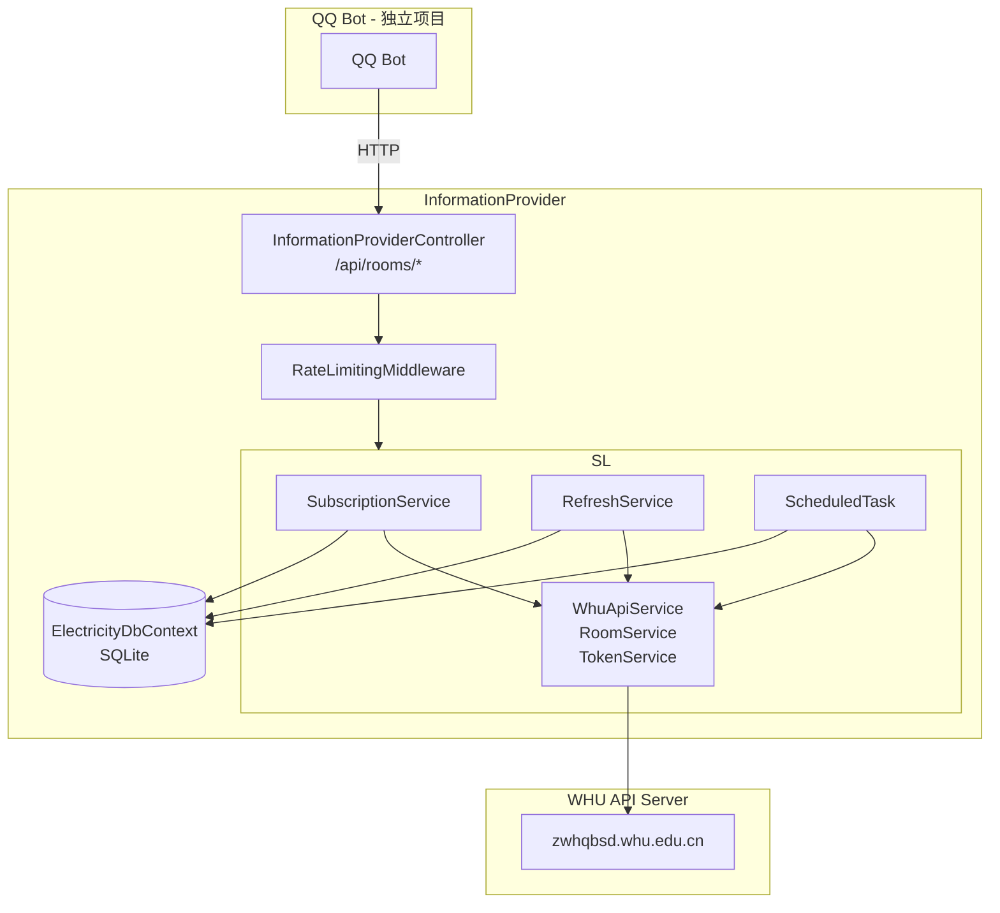

# Design Details

## 架构总览



## 关键流程

### 订阅流程

1. QQ Bot 发送 `POST /api/rooms { "roomId": "xxx" }`
2. Controller 接收请求，调用 SubscriptionService
3. SubscriptionService：
   a. 查 DB：房间是否已订阅？是 → 返回 409
   b. 调用 `WhuApiService.GetRoomMeterInfo(roomId)` 获取 RoomName
   c. 写入 Subscription 表
   d. 启动回填：
      - `chunkEnd = yesterday`（当天的数据尚未产生）
      - while True:
        - `chunkStart = chunkEnd - 99 days`（每块 100 天）
        - 调用 `GetMeterDayValue(roomId, chunkStart, chunkEnd)` 批量拉取
        - 返回空 → break（已穷尽历史数据）
        - 去重：过滤掉 `DailyUsageRecord` 中已有的日期
        - 批量写入到 `DailyUsageRecord`
        - 找到返回记录中的最早日期 → `chunkEnd = 最早日期 - 1 day`
   e. 调用 `GetReserve(roomId)` 记录首次余额到 `DailyBalanceRecord`
   f. 返回成功响应

### 定时任务流程

1. `BackgroundService` 在凌晨 2:00 触发
2. 从 DB 读取所有 Subscription
3. 对每个 RoomId 并行（最多同时 5 个）：
   - 调用 `GetMeterDayValue(roomId, yesterday)` → 写入 DailyUsageRecord
   - 调用 `GetReserve(roomId)` → 写入 DailyBalanceRecord
4. 失败的任务加入重试队列，15 分钟后重试

### 查询流程（余额/日用量/趋势）

1. QQ Bot 发送 GET 请求
2. `RateLimitingMiddleware` 检查限频：
   - 超出 → 返回 429
3. Controller 调用对应的 Service 方法
4. Service 直接从 DbContext 读取数据
5. 有数据 → 200 + 数据
6. 无数据 → 404

## 限频实现

```csharp
// 使用内存缓存记录请求时间
// 键格式: "rate_limit:{roomId}:{endpointType}"
// 值: DateTime (上次请求时间)

public class RateLimitingMiddleware
{
    public Task InvokeAsync(HttpContext context)
    {
        var key = $"rate_limit:{roomId}:{endpointName}";
        var lastRequest = cache.Get<DateTime>(key);
        if (lastRequest != null && 
            DateTime.UtcNow - lastRequest < config.Interval)
        {
            return 429;
        }
        cache.Set(key, DateTime.UtcNow, config.Interval * 2);
        await _next(context);
    }
}
```

## 配置结构

```json
{
    "RateLimiting": {
        "QueryInterval": "01:00:00",
        "RefreshInterval": "00:30:00",
        "RefreshEnabled": true
    },
    "ScheduledTask": {
        "RunTime": "02:00",
        "RetryInterval": "00:15:00",
        "MaxConcurrent": 5
    },
    "Backfill": {
        "ChunkSizeDays": 100
    },
    "WhuApi": {
        "BaseUrl": "http://zwhqbsd.whu.edu.cn/ICBS_V2_Server"
    },
    "ConnectionStrings": {
        "Default": "Data Source=electricity.db"
    }
}
```
