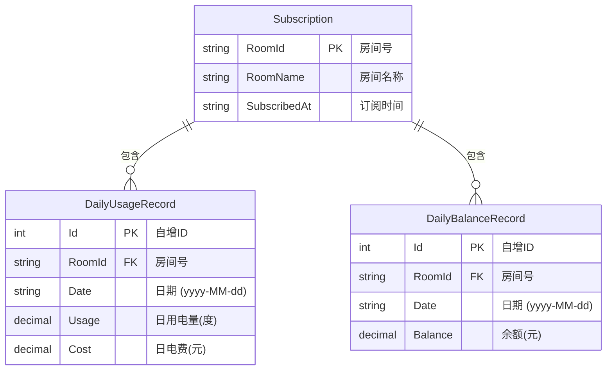

# Entity-Relationship Diagram

## 说明

- **Subscription** 与 **DailyUsageRecord** 是 1:N 关系：一个房间有多天的用电记录
- **Subscription** 与 **DailyBalanceRecord** 是 1:N 关系：一个房间有多天的余额快照
- **DailyUsageRecord** 和 **DailyBalanceRecord** 之间无直接关联，它们通过 `RoomId` 和 `Date` 在应用层联合

## 索引

| 表 | 索引字段 | 目的 |
|---|---|---|
| DailyUsageRecord | (RoomId, Date) UNIQUE | 阻止重复数据，加速按房号+日期查询 |
| DailyUsageRecord | (RoomId) | 加速按房间查询 |
| DailyUsageRecord | (RoomId, Date) | 加速区间范围查询 |
| DailyBalanceRecord | (RoomId, Date) UNIQUE | 阻止重复数据，加速趋势区间查询 |
| DailyBalanceRecord | (RoomId) | 加速按房间查询 |
